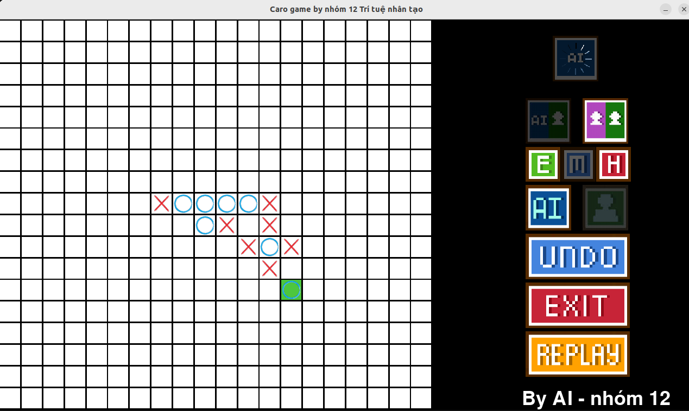
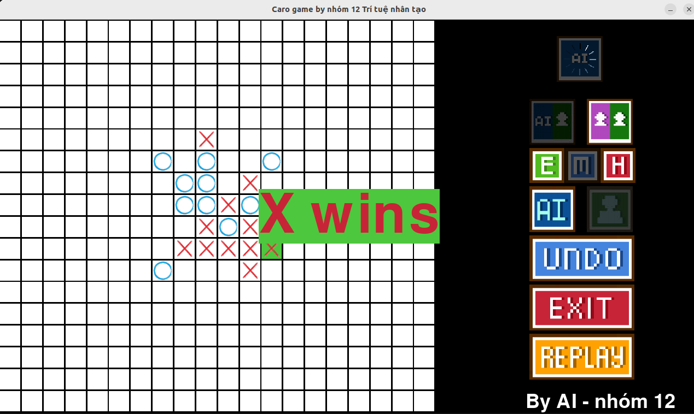

# Caro_AI

The Caro AI game with a strong heuristic AI built on minimax and alpha-beta pruning. The codebase has grown from a compact student project into a version with deeper search, optional native acceleration, benchmark tooling, and configurable difficulty.

---

## For people who just want to play

### Windows

Open `dist/Caro_AI.exe`

### Ubuntu

Open `dist/Caro_AI_Ubuntu`

## Project layout

| Path | Role |
|------|------|
| `main.py` | Thin entry: run `python main.py` from the repo root. |
| `caro_ai/` | Python package: game, UI, AI agent, and the main app loop. |
| `caro_ai/app.py` | Pygame UI, presets (`PLAYER_VS_AI_PRESETS`); dev/benchmark modes via CLI flags. |
| `caro_ai/game/` | Board rules and `Caro` state. |
| `caro_ai/ui/` | Button widgets. |
| `caro_ai/ai/` | `Agent` (search / evaluation). |
| `assets/` | Images and icons for the UI (bundled as `assets` in PyInstaller). |
| `config/` | `dev_mode.json`, `benchmark_config.json` (external JSON settings). |
| `benchmarks/results/` | Benchmark outputs (summary and board `.txt` files). |
| `extensions/` | Cython sources (`*.pyx`) for optional acceleration. |
| `notebooks/` | e.g. `benchmark_analysis.ipynb`. |
| `docs/` | Extra notes and static pages. |
| `dist/` | Folder containing packaged executables for Windows and Linux. |

---

## Version note

### Original baseline (early README / classic behavior)

- Core AI: **minimax** with **alpha-beta pruning**.
- Run the game with **Python** and **Pygame** after installing dependencies from `requirements.txt`.
- Entry point: `main.py`.
- Packaged release was described as a downloadable archive; development setup used `pip install pygame` (and optional Tk on Linux for some environments).

### Current version (what is new)

Search and evaluation:

- **Move ordering** so alpha-beta cuts branches earlier.
- **Transposition table** with **Zobrist hashing** to reuse scores for repeated positions.
- **Beam search / forward pruning** (configurable beam widths).
- **Incremental evaluation** to update heuristic locally instead of rescanning the board.
- **Iterative deepening** with reuse of prior principal variation for ordering.
- **Threat-oriented search** (VCF-style tactical layer) and related options, configurable per agent.
- **Time budget per move** (`move_time_budget_sec`); search can stop between completed depths and keep the last fully finished result.
- **Adaptive depth / beam** by game stage where enabled.

Performance:

- Optional **Cython extensions**: heuristic acceleration (`agent_accel`) and a compiled minimax path (`search_accel`). Build with `setup_cython.py` (see below).
- Optional **lazy SMP** (parallel root helpers) where configured.
- **AI move computation in a worker process** so the Pygame loop stays responsive while the agent thinks.

Gameplay and UI:

- **Resizable window** with layout that scales the board and controls.
- **Single turn timer** for the active side; timer stops when the game ends.
- **Player vs AI** and **AI vs AI (developer mode)** with Start / Pause (dev and benchmark), Undo, Replay.
- **Player vs AI difficulty** is no longer “depth only”: **Easy / Medium / Hard** map to full **preset configs** (`PLAYER_VS_AI_PRESETS` near the top of `caro_ai/app.py`: depth plus all relevant `Agent` options).

Benchmarking and analysis:

- **Benchmark mode** (`python main.py --benchmark`) runs scheduled matchups from **`config/benchmark_config.json`** (merged over inline `benchmark_setup` defaults in `caro_ai/app.py`).
- Results append incrementally under **`benchmarks/results/`**:
  - `benchmark_results_summary.txt` — structured fields per game.
  - `benchmark_results_boards.txt` — ASCII board, agents, outcome per side.
- **Resume**: on a fresh program start, benchmark mode can advance to the **next** matchup/game based on the last valid `match_id` in the summary file (entries that do not match the current config are ignored).
- **`notebooks/benchmark_analysis.ipynb`**: parse the text outputs and plot win rates, timings, Elo-style summaries, heatmaps, etc.

---

## How to use (current project)

### 1. Choose the mode on the command line

```text
python main.py                 # Human vs AI (default)
python main.py --dev         # AI vs AI; reads config/dev_mode.json
python main.py --benchmark   # Benchmark; requires config/benchmark_config.json
```

Options:

- `--dev-config PATH` — dev JSON file (default when using `--dev`: `config/dev_mode.json`).
- `--benchmark-config PATH` — benchmark JSON file (default when using `--benchmark`: `config/benchmark_config.json`).

`--dev` and `--benchmark` are mutually exclusive. Run `python main.py -h` for full help.

**Human vs AI:** run `python main.py` and use the on-screen controls (AI vs Player, difficulty, who moves first, etc.).

### 2. Player vs AI difficulty presets

Edit **`PLAYER_VS_AI_PRESETS`** near the top of `caro_ai/app.py`. Each of `easy`, `medium`, and `hard` has:

- **`depth`**: search depth for that preset.
- **`config`**: full agent configuration (Cython search, TSS, lazy SMP, beam widths, time budget, and any other keys supported by `Agent`).

The in-game **E / M / H** buttons select which preset is active and rebuild the agent.

### 3. Developer mode (AI vs AI)

Run `python main.py --dev` and edit **`config/dev_mode.json`**: `ai_1` / `ai_2`, `ai_*_depth`, `ai_*_config`, and related fields.

- **Start** begins the match (timer follows the existing dev-mode rules).
- **Pause** stops the loop and cancels in-flight worker computation; **Start** resumes.

If `config/dev_mode.json` is missing, the program uses built-in defaults and prints a warning. If you pass **`--dev-config`** explicitly, that file must exist.

### 4. Benchmark mode

Run `python main.py --benchmark` (requires **`config/benchmark_config.json`**).

- Edit the JSON: `games_per_matchup`, `matchups` (each with `name`, `agent_a`, `agent_b`, labels, `depth`, per-agent `config`).
- Press **Start** in the UI to begin (exact wiring is in `caro_ai/app.py`).
- **Pause** pauses the benchmark run and stops the worker; **Start** resumes.
- **Replay** (in benchmark) restarts the **current** scheduled game for the current pair without advancing the schedule.
- Output files under **`benchmarks/results/`** (`benchmark_results_summary.txt`, `benchmark_results_boards.txt`) grow by append; restarting the app can **resume** from the last completed valid game if the config still matches.

### 5. Analysis notebook

Open **`notebooks/benchmark_analysis.ipynb`** in Jupyter, ensure the summary and boards text files are present under `benchmarks/results/`, and run the cells to regenerate tables and plots.

---

## Optional: Cython build (faster search / eval)

Install build tools:

```bash
pip install cython setuptools
```

Compile extensions from the project root (sources live in `extensions/`; built modules are placed in the root for `import agent_accel` / `import search_accel`):

```bash
python3 setup_cython.py build_ext --inplace
```

On Windows, use `python setup_cython.py build_ext --inplace` if `python3` is not on your PATH.

If extensions are missing, the game can still run with the pure-Python paths where configured.

---

## Requirements and run

Install dependencies:

```bash
pip install -r requirements.txt
```

Run:

```bash
python3 main.py
```

(or `python main.py` on Windows)

---

## Screenshot





---

## Development environment

Python version: **3.11**

### Linux

Optional Tk (if your tooling needs it):

```bash
sudo apt install python3.11-tk
```

Then install Pygame and requirements as above.

### Windows

Install Pygame and requirements with `pip` as usual.

---

## Tags

#Caro #CaroAI #Github #Minimax #AlphaBeta
